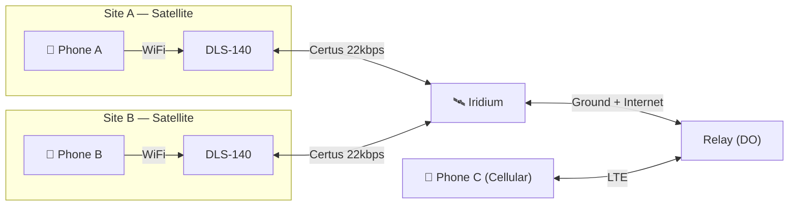

<!-- SLIDE 1 — Title -->

# TheForbiddenLAN

<h2>Satellite Push-to-Talk for Aviation Ground Crews</h2>

Shri &nbsp;·&nbsp; Saim &nbsp;·&nbsp; Maisam &nbsp;·&nbsp; Annie

SkyTrac Hackathon 2026

<!-- One sentence intro, go straight to demo. -->

---
layout: center
---

<!-- SLIDE 2 — Live Demo -->

<h1 style="font-size: 4.5rem; font-weight: 900; color: #F8FAFC; letter-spacing: -0.04em;">LIVE DEMO</h1>

  <ol style="list-style: decimal; padding-left: 1.5rem; text-align: left; display: inline-block;">
    <li>PTT between two phones</li>
    <li>Floor indicator behavior</li>
    <li>Talkgroup switching</li>
    <li>Moving map</li>
    <li>Web portal</li>
  </ol>

<!-- Narrate UX decisions as you go. Backup clip ready if signal drops. -->

---
layout: default
---

<!-- SLIDE 3 — How We Approached the Constraints -->

# How We Approached the Constraints

  "You know this hardware — here's how we prioritized."

We optimized for:

- **Latency over reliability for audio** — drop a frame, don't freeze the call
- **Instant PTT feel** — no server round-trip before the mic opens
- **Stay under budget at every layer** — codec, field stripping, sessionId compression
- **Graceful degradation** — dual delivery survives expired NAT mappings
- **Designed for the real envelope** — 22 kbps is the ceiling; link degrades to ~900 bps. Architecture adapts: Opus 6 kbps on strong signal, Codec2 2.4 kbps below 2 bars

We consciously deferred:

- Binary framing
- Full AES-GCM
- iOS support

<!-- 22kbps is the spec-sheet number. Judges know the real link performance varies. Call that out here — it shows you understand the hardware, not just the datasheet. -->

---
layout: two-cols
---

<!-- SLIDE 4 — Scope & What We Shipped -->

# Scope & What We Shipped

<h3 class="shipped">Shipped</h3>

- ✅ Half-duplex PTT over Iridium + cellular
- ✅ Talkgroup routing, membership, floor control
- ✅ Client-side GPS timestamp arbitration
- ✅ Text messaging + live moving map
- ✅ Web portal: device / talkgroup / key management
- ✅ Dual UDP+WebSocket with client deduplication

Bonus criteria also shipped:

- ✅ Moving map
- ✅ Walk-on prevention
- ✅ Talkgroup switching

::right::

<h3 class="warn">Post-hackathon</h3>

- Binary wire format *(JSON overhead within budget now)*
- Full AES-GCM + KDF *(architecture done, implementation stubbed)*
- Distributed sync protocol *(designed, not implemented)*
- iOS build *(needs macOS toolchain)*

<!-- Be explicit that deferred items were deliberate decisions, not oversights. -->

---
layout: default
---

<!-- SLIDE 5 — System Architecture -->

# System Architecture

  <strong>CGN constraint:</strong> DLS-140 is outbound-only — it initiates the connection through carrier-grade NAT. The relay cannot dial in. Once the session is established, data flows both ways on that same connection. No direct device-to-device path exists.

<!-- Four relay roles: 1) Real-Time Relay — fan out PTT audio via WS+UDP. 2) Floor Control — server watchdog enforces half-duplex. 3) Operation Log — append-only admin op sequencing. 4) Sync Broker — cursor-based catch-up for reconnecting devices. -->

---
layout: default
---

<!-- SLIDE 6 — The Relay: Four Roles -->

# The Relay — Four Roles

  DLS-140 is outbound-only (CGN). All traffic flows through the relay — no device-to-device possible.

Real-Time Relay

Fan out PTT audio + control to talkgroup members via WebSocket + UDP simultaneously. In-memory only — no DB on the critical audio path.

Floor Control

Server-authoritative half-duplex. Validates the floor holder, drops frames from non-holders, 65s watchdog auto-releases on crash or disconnect.

Auth & Provisioning

JWT issued via REST (register / login). Role-based enforcement on every WebSocket message. Admin ops require signed messages — relay can't forge them.

Op Log + Sync Broker

Append-only admin op log with monotonic sequence numbers. Cursor-based catch-up delivers missed ops to devices reconnecting after a handoff dropout.

<!-- This answers "what does the relay actually do?" — 4 distinct roles, not just a dumb forwarder. Judges scoring Architecture (15%) will want to see this decomposition. -->

---
layout: default
---

<!-- SLIDE 6 — Floor Control -->

# Floor Control

  The hardest problem who talks when, with 1500 ms RTT?

  

    
What we did NOT do

    
Server-grant model → 1–3 s dead air → broken UX

  

  

    
What we did

    
Optimistic transmission + client-side deterministic arbitration

  

**Algorithm:**

1. User presses PTT → audio starts **immediately**
2. `PTT_START` broadcast to all talkgroup members
3. Each client runs the same algorithm independently:
   - Single `PTT_START` within window → that sender has floor
   - Two `PTT_START` within 50 ms → **lower GPS timestamp wins**; UUID as tiebreaker
4. Loser UI shows "floor taken", mic stops

  GNSS on DLS-140 is nanosecond-accurate + globally synced. Every receiver reaches the same conclusion independently. Tradeoff: ~50 ms collision window. Instant PTT feel preserved.

<!-- Server's watchdog role: if PTT_END never arrives (crash / disconnect), server forcibly releases the floor after a timeout so the channel doesn't stay locked. -->

---
layout: default
---

<!-- SLIDE 7 — Messaging Framework -->

# Why WebSocket + UDP

  Iridium is store-and-forward — data arrives in bursts, not a continuous stream. TCP audio = voicemail, not radio.

  

    
UDP for audio

    <ul style="font-size: 0.86rem; margin: 0.25rem 0 0; padding-left: 1.1rem;">
      <li>Independent datagrams bypass TCP buffering</li>
      <li>Opus FEC conceals packet loss</li>
      <li><code>INBAND_FEC=1</code> &nbsp;<code>PACKET_LOSS_PERC=20%</code></li>
    </ul>
  

  

    
WebSocket for control

    <ul style="font-size: 0.86rem; margin: 0.25rem 0 0; padding-left: 1.1rem;">
      <li><code>PTT_START</code> / <code>PTT_END</code> must be reliable</li>
      <li>Store-and-forward delay is fine for control</li>
    </ul>
  

| Message | Transport |
|---|---|
| PTT_AUDIO | UDP + WebSocket (dual — client deduplicates by sessionId+chunk) |
| PTT_START / PTT_END | WebSocket |
| JOIN/LEAVE, TEXT | WebSocket |
| GPS_UPDATE | WebSocket |
| UDP_REGISTER | UDP only |

<!-- Dual delivery means the server relays audio over both UDP and WebSocket unconditionally. No satellite-mode gate. -->

---
layout: default
---

<!-- SLIDE 9 — Bandwidth Budget -->

# Bandwidth Budget

22 kbps is the ceiling — designed for the real operating envelope

<h3 style="color: var(--info); font-size: 1.05rem; font-weight: 600; margin: 0 0 0.25rem;">Measured on hardware (Opus 6 kbps, 60ms frames)</h3>

| Layer | Bytes/frame |
|---|---|
| Raw Opus | 42 B |
| + Base64 | 56 B |
| + JSON framing | ~119 B total |

  
~15.9 kbps

  
72% of 22 kbps budget

  <code>sessionId</code> int vs UUID saves ~31 chars/packet. <code>PTT_AUDIO</code> omits talkgroup field — server routes via sessionId map seeded at PTT_START.

<h3 style="color: var(--info); font-size: 1.05rem; font-weight: 600; margin: 0 0 0.25rem;">Adaptive by signal strength</h3>

| Signal | Codec | On-wire |
|---|---|---|
| > 3 bars | Opus 6 kbps | ~15.9 kbps |
| < 2 bars | Codec2 2.4 kbps | ~9.4 kbps |

  Link degrades to ~900 bps in very poor conditions — text messaging always available when voice budget runs out.

<!-- Tradeoff: JSON + Base64 is within budget now so binary framing is deferred. Binary protocol post-hackathon would drop ~30B/packet and bring the Opus footprint to ~11kbps on the wire. -->

---
layout: default
---

<!-- SLIDE 9 — Mobile App: PTT & Core Flow -->

# Mobile App — Core Flow

  

    

      <!-- [INSERT SCREENSHOT: login.png] -->
      Login
    

  

  

    

      <!-- [INSERT SCREENSHOT: talkgroup-list.png] -->
      Talkgroup List
    

  

  

    

      <!-- [INSERT SCREENSHOT: ptt-screen.png] -->
      PTT Screen
    

    

      Active speaker indicator. Floor status. Floor indicator updates before audio starts.
    

  

<!-- The PTT screen is the hero. Talk through each UI element: big push-to-talk button, speaker name, floor indicator, signal quality badge. This is 30% of the score — spend time here. -->

---
layout: default
---

<!-- SLIDE 10 — Mobile App: Map & Chat -->

# Mobile App — Map & Chat

  

    

      <!-- [INSERT SCREENSHOT: moving-map.png] -->
      Moving Map — live GPS pins, talkgroup-filtered
    

  

  

    

      <!-- [INSERT SCREENSHOT: text-chat.png] -->
      Text Chat — per-talkgroup with timestamps
    

  

  <strong>Moving map = Innovation bonus criteria (+15%).</strong> Call it out explicitly to the judges.

<!-- Name it as a bonus feature. Judges are scoring it explicitly. Say "this is one of the stated bonus criteria." -->

---
layout: default
---

<!-- SLIDE 11 — Web Admin Portal -->

# Web Admin Portal

  

    

      <!-- [INSERT SCREENSHOT: portal-dashboard.png] -->
      Dashboard
    

  

  

    

      <!-- [INSERT SCREENSHOT: portal-talkgroups.png] -->
      Talkgroup Management
    

  

  

    

      <!-- [INSERT SCREENSHOT: portal-devices.png] -->
      Device Management
    

  

  

    

      <!-- [INSERT SCREENSHOT: portal-keys.png] -->
      Key Rotation
    

  

<!-- Web portal usability is explicitly in the UX rubric (30%). Walk through each screen: dashboard shows active devices and talkgroup membership at a glance; key rotation triggers ADMIN_ROTATE_KEY op which fans out to all members. -->

---
layout: center
---

<!-- SLIDE 13 — Q&A -->

<h1 style="font-size: 4.5rem; font-weight: 900; color: #F8FAFC; letter-spacing: -0.04em;">Q&A</h1>

  Floor Control
  UDP vs WebSocket
  Bandwidth Math
  Encryption
  P2P / Multicast
  Codec Choice

  Slides 6, 7, and 9 available to pull back up &nbsp;·&nbsp; Tradeoffs summary in appendix

<!-- "Did you test over satellite?" is the most likely judge question. Answer: yes — we used the DLS-140 hardware during development. The store-and-forward behavior is the reason UDP was non-negotiable. That store-and-forward story is also the best answer to "what was the most surprising thing about building on Iridium Certus." -->

---
layout: default
---

<!-- APPENDIX — Design Tradeoffs -->

# Design Tradeoffs (Appendix)

| Decision | Chose | Rejected | Why |
|---|---|---|---|
| Audio transport | UDP + Opus FEC | WebSocket only | Iridium store-and-forward; TCP audio arrives in bursts |
| Floor control | Client-side GPS arbitration | Server-grant | Server RTT = 1–3 s dead air |
| Audio codec | Opus 6 kbps · 42 B/frame measured | Higher bitrate | Must fit 22 kbps; validated on hardware |
| Audio framing | JSON + Base64 | Binary protocol | Within budget now; binary saves ~30B/packet post-hackathon |
| Encryption | AES-GCM architecture (stub impl) | No encryption | Relay moves opaque blobs; crypto is a drop-in swap |
| Mobile platform | React Native Android | Native iOS | macOS toolchain needed; team on Linux |

<!-- Pull this up during Q&A if asked for the at-a-glance summary. Each row has already been covered in detail during slides 7, 8, and 9. -->
