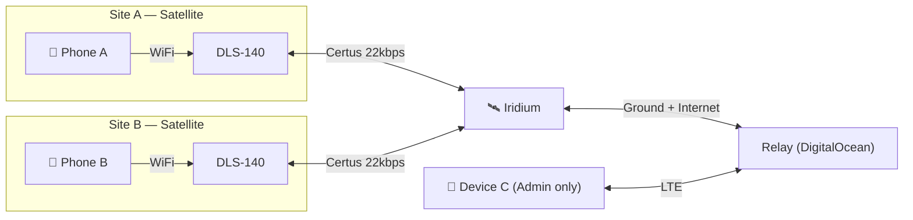
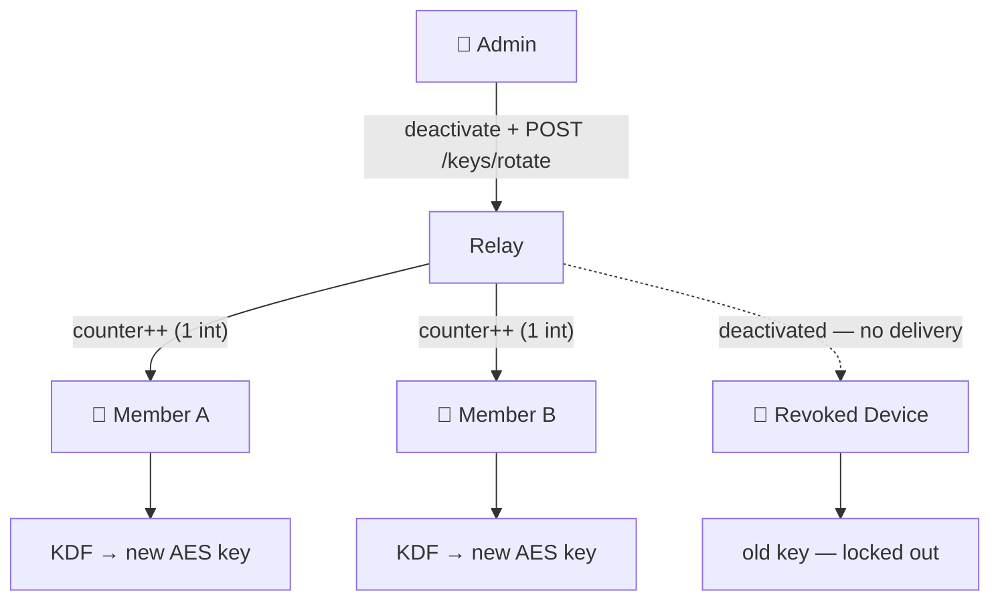
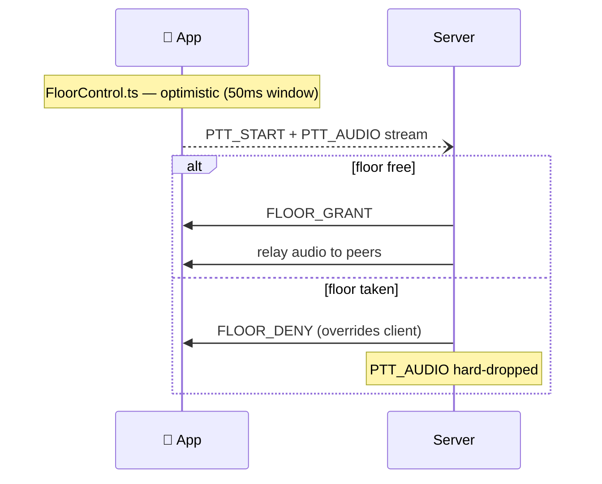
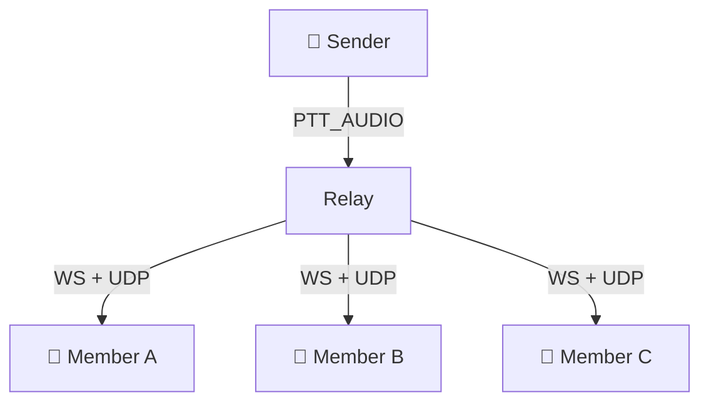

<!-- SLIDE 1 — Title -->

# TheForbiddenLAN

<h2>Satellite Push-to-Talk for Aviation Ground Crews</h2>

Shri &nbsp;·&nbsp; Saim &nbsp;·&nbsp; Maisam &nbsp;·&nbsp; Annie

SkyTrac Hackathon 2026

<!-- One sentence intro, go straight to demo. -->

---
layout: center
---

<!-- SLIDE 2 — Live Demo -->

<h1 style="font-size: 4.5rem; font-weight: 900; color: #F8FAFC; letter-spacing: -0.04em;">LIVE DEMO</h1>

  <ol style="list-style: decimal; padding-left: 1.5rem; text-align: left; display: inline-block;">
    <li>PTT between two phones</li>
    <li>Floor indicator behavior</li>
    <li>Talkgroup switching</li>
    <li>Moving map</li>
    <li>Web portal</li>
  </ol>

<!-- Narrate UX decisions as you go. Backup clip ready if signal drops. -->

---
layout: default
---

<!-- SLIDE 3 — How We Approached the Constraints -->

# How We Approached the Constraints

  "You know this hardware — here's how we prioritized."

We optimized for:

- **Latency over reliability for audio** — drop a frame, don't freeze the call
- **Instant PTT feel** — no server round-trip before the mic opens
- **Stay under budget at every layer** — codec, field stripping, sessionId compression
- **Graceful degradation** — dual delivery survives expired NAT mappings
- **Designed for the real envelope** — 22 kbps is the ceiling; link degrades to ~900 bps. Architecture adapts: Opus 6 kbps on strong signal, Codec2 2.4 kbps below 2 bars

We consciously deferred:

- Binary framing
- iOS support

<!-- 22kbps is the spec-sheet number. Judges know the real link performance varies. Call that out here — it shows you understand the hardware, not just the datasheet. -->

---
layout: two-cols
---

<!-- SLIDE 4 — Scope & What We Shipped -->

# Scope & What We Shipped

<h3 class="shipped">Shipped</h3>

- ✅ Half-duplex PTT over Iridium + cellular
- ✅ Talkgroup routing, membership, floor control
- ✅ Client-side GPS timestamp arbitration
- ✅ Text messaging + live moving map
- ✅ Web portal: device / talkgroup / key management
- ✅ Dual UDP+WebSocket with client deduplication
- ✅ AES-GCM encryption + KDF key derivation per talkgroup

Bonus criteria also shipped:

- ✅ Moving map
- ✅ Walk-on prevention
- ✅ Talkgroup switching

::right::

<h3 class="warn">Post-hackathon</h3>

- Binary wire format *(JSON overhead within budget now)*
- Distributed sync protocol *(designed, not implemented)*
- iOS build *(needs macOS toolchain)*

<!-- Be explicit that deferred items were deliberate decisions, not oversights. -->

---
layout: default
---

<!-- SLIDE 5 — System Architecture -->

# System Architecture

  <strong>CGN constraint:</strong> DLS-140 is outbound-only — it initiates the connection through carrier-grade NAT. The relay cannot dial in. Once the session is established, data flows both ways on that same connection. No direct device-to-device path exists.

<!-- Four relay roles: 1) Real-Time Relay — fan out PTT audio via WS+UDP. 2) Floor Control — server watchdog enforces half-duplex. 3) Operation Log — append-only admin op sequencing. 4) Sync Broker — cursor-based catch-up for reconnecting devices. -->

---
layout: default
---

<!-- SLIDE 6b — Key Management -->

# Key Management — Derived, Not Distributed

Rotating a key costs 1 integer over SATCOM. Deactivated devices can't fetch the new counter — they can't derive the new group key.

Add member

Send <code>master_secret</code> + current counter over TLS — 1 message

Rotate keys

Increment counter — <strong>1 integer, no key material</strong>

Remove member

Deactivate + rotate — revoked device can't fetch new counter → locked out

---
layout: default
---

<!-- SLIDE 6 — Floor Control -->

# Floor Control

  The hardest problem who talks when, with 1500 ms RTT?

  

    
Server-only grant (rejected)

    
Wait for round-trip before transmitting → 1–3 s dead air → broken UX

  

  

    
Two-layer: optimistic + authoritative

    
Client pre-checks locally so PTT feels instant. Server is the hard enforcer.

  

- **Layer 1 — `FloorControl.ts`:** Optimistic check on press → TX starts immediately. 50 ms window; lowest timestamp wins, UUID tiebreak.
- **Layer 2 — `hub.ts`:** `FLOOR_GRANT` or `FLOOR_DENY` on `PTT_START`. `PTT_AUDIO` from non-holder is hard-dropped.

Watchdog: floor auto-releases after 65 s if <code>PTT_END</code> never arrives.

---
layout: default
---

<!-- SLIDE — The Relay: Fan-Out -->

# The Relay — Fan-Out

Every PTT_AUDIO packet is relayed to all talkgroup members — no device-to-device path exists

Both transports unconditionally — not gated on satellite mode. Clients deduplicate by <code>sessionId + chunk</code>. Floor control validates the sender before relaying.

---
layout: default
---

<!-- SLIDE 7 — Messaging Framework -->

# Why WebSocket + UDP

  Iridium is store-and-forward — data arrives in bursts, not a continuous stream. TCP audio = voicemail, not radio.

  

    
UDP for audio

    <ul style="font-size: 0.86rem; margin: 0.25rem 0 0; padding-left: 1.1rem;">
      <li>Independent datagrams bypass TCP buffering</li>
      <li>Opus FEC conceals packet loss</li>
      <li><code>INBAND_FEC=1</code> &nbsp;<code>PACKET_LOSS_PERC=20%</code></li>
    </ul>
  

  

    
WebSocket for control

    <ul style="font-size: 0.86rem; margin: 0.25rem 0 0; padding-left: 1.1rem;">
      <li><code>PTT_START</code> / <code>PTT_END</code> must be reliable</li>
      <li>Store-and-forward delay is fine for control</li>
    </ul>
  

| Message | Transport |
|---|---|
| PTT_AUDIO | UDP + WebSocket (dual — client deduplicates by sessionId+chunk) |
| PTT_START / PTT_END | WebSocket |
| JOIN/LEAVE, TEXT | WebSocket |
| GPS_UPDATE | WebSocket |
| UDP_REGISTER | UDP only |

<!-- Dual delivery means the server relays audio over both UDP and WebSocket unconditionally. No satellite-mode gate. -->

---
layout: default
---

<!-- SLIDE 9 — Bandwidth Budget -->

# Bandwidth Budget

22 kbps is the ceiling — designed for the real operating envelope

<h3 style="color: var(--info); font-size: 1.05rem; font-weight: 600; margin: 0 0 0.25rem;">Measured on hardware (Opus 6 kbps, 60ms frames)</h3>

| Layer | Bytes/frame |
|---|---|
| Raw Opus | 42 B |
| + Base64 | 56 B |
| + JSON framing | ~119 B total |

  
~15.9 kbps

  
72% of 22 kbps budget

  <code>sessionId</code> int vs UUID saves ~31 chars/packet. <code>PTT_AUDIO</code> omits talkgroup field — server routes via sessionId map seeded at PTT_START.

<h3 style="color: var(--info); font-size: 1.05rem; font-weight: 600; margin: 0 0 0.25rem;">Adaptive by signal strength</h3>

| Signal | Codec | On-wire |
|---|---|---|
| > 3 bars | Opus 6 kbps | ~15.9 kbps |
| < 2 bars | Codec2 2.4 kbps | ~9.4 kbps |

  Link degrades to ~900 bps in very poor conditions — text messaging always available when voice budget runs out.

<!-- Tradeoff: JSON + Base64 is within budget now so binary framing is deferred. Binary protocol post-hackathon would drop ~30B/packet and bring the Opus footprint to ~11kbps on the wire. -->

---
layout: default
---

<!-- SLIDE 9 — Mobile App -->

# Mobile App

  

    
    
Unified auth · admin role auto-detected · device registration

  

  

    

      <!-- [INSERT SCREENSHOT: home.png] -->
      Home
    

    
Active users · signal strength · notifications feed

  

  

    

      <!-- [INSERT SCREENSHOT: channels.png] -->
      Channels
    

    
Browse talkgroups · inline PTT · live indicator · member count

  

  

    

      <!-- [INSERT SCREENSHOT: ptt-screen.png] -->
      PTT
    

    
Large button · orbit visualization · floor status · satellite visibility

  

  

    

      <!-- [INSERT SCREENSHOT: profile.png] -->
      Profile
    

    
Callsign · display name · preferred link · session info

  

  <strong>Moving map is an explicitly scored bonus criterion.</strong> Call it out during the demo.

<!-- PTT screen is the hero. Orbit visualization shows who's in the talkgroup at a glance. Floor status updates before audio starts — client-side arbitration means zero dead air on press. -->

---
layout: default
---

<!-- SLIDE 11 — Web Admin Portal -->

# Web Admin Portal

  

    
    
Devices online · active talkgroups · device status table

  

  

    
    
Create · manage members · trigger key rotation

  

  

    
    
Register · assign role · remove

  

  

    
    
Live device GPS · active/inactive status · auto-refresh

  

  

    
    
Connected sockets · relay metrics · live logs · floor holders

  

<!-- Web portal usability is in the UX rubric (30%). Key rotation lives in Talkgroups — triggering it fans out the new counter to all active members. -->

---
layout: center
---

<!-- SLIDE 13 — Q&A -->

<h1 style="font-size: 4.5rem; font-weight: 900; color: #F8FAFC; letter-spacing: -0.04em;">Q&A</h1>

  Floor Control
  UDP vs WebSocket
  Bandwidth Math
  Encryption
  P2P / Multicast
  Codec Choice

  Slides 6, 7, and 9 available to pull back up &nbsp;·&nbsp; Tradeoffs summary in appendix

<!-- "Did you test over satellite?" is the most likely judge question. Answer: yes — we used the DLS-140 hardware during development. The store-and-forward behavior is the reason UDP was non-negotiable. That store-and-forward story is also the best answer to "what was the most surprising thing about building on Iridium Certus." -->

---
layout: default
---

<!-- APPENDIX — Design Tradeoffs -->

# Design Tradeoffs (Appendix)

| Decision | Chose | Rejected | Why |
|---|---|---|---|
| Audio transport | UDP + Opus FEC | WebSocket only | Iridium store-and-forward; TCP audio arrives in bursts |
| Floor control | Client-side GPS arbitration | Server-grant | Server RTT = 1–3 s dead air |
| Audio codec | Opus 6 kbps · 42 B/frame measured | Higher bitrate | Must fit 22 kbps; validated on hardware |
| Audio framing | JSON + Base64 | Binary protocol | Within budget now; binary saves ~30B/packet post-hackathon |
| Encryption | AES-GCM + KDF per talkgroup | No encryption | Relay moves opaque blobs; rotation costs 1 integer over SATCOM |
| Mobile platform | React Native Android | Native iOS | macOS toolchain needed; team on Linux |

<!-- Pull this up during Q&A if asked for the at-a-glance summary. Each row has already been covered in detail during slides 7, 8, and 9. -->
