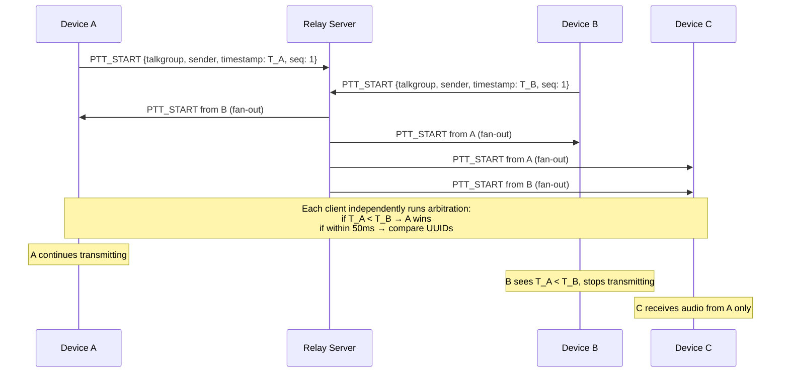

# Floor Control

PTT is half-duplex: one speaker per talkgroup at a time. The architectural challenge is arbitration. This page explains why server-side grant/deny is incompatible with satellite latency, and what we do instead.

---

## Why Server Grant/Deny Is Out

At 500–1500 ms one-way satellite latency, a server-issued FLOOR_GRANT means:

1. User presses PTT
2. `PTT_REQUEST` travels to server: +500–1500 ms
3. Server decides and sends `FLOOR_GRANT` back: +500–1500 ms
4. User's device receives grant: **1–3 seconds after button press**

Professional PTT radio users expect sub-100 ms from button press to transmit. A 1–3 second wait is unusable in an operational environment. TETRA, DMR, and every deployed PTT system avoid this.

**The server does not send `FLOOR_GRANT` or `FLOOR_DENY` in v1. It fans out `PTT_START` messages only.**

---

## The Algorithm: Optimistic Transmission



### Step-by-step

1. **User presses PTT.** The phone immediately begins capturing and transmitting audio. No permission requested.
2. **`PTT_START` is sent.** Carries GPS timestamp (from DLS-140 GNSS) and device UUID.
3. **Relay fans it out.** Server fans `PTT_START` to all talkgroup members. Server applies no logic.
4. **Each receiver runs arbitration independently:**
   - If one `PTT_START` arrived: that sender has the floor.
   - If two `PTT_START` messages arrive within a **50 ms window** (collision): lower GPS timestamp wins. Tiebreaker: lexicographically smaller device UUID.
5. **Loser stops.** The losing device's UI shows "floor taken". It stops transmitting.

---

## Why This Is Correct

The algorithm is **deterministic and stateless**. Given the same set of `PTT_START` messages, every receiver — regardless of location, packet timing, or network conditions — reaches the **same winner**. No coordination is needed. No server message is required.

All receivers see the same messages because the relay fans them all out. The algorithm runs identically on every device. Consensus emerges without a consensus round.

---

## Why GPS Timestamps

The DLS-140 provides GNSS timestamps that are:
- **Globally synchronized** — GPS atomic clocks agree across all aircraft
- **Nanosecond resolution** — far finer than the 50 ms collision window
- **Available on every device** that has a DLS-140 on its local LAN

Clock skew between sites is negligible compared to satellite latency. The `SYNC_TIME` mechanism in the comms library provides a software offset correction for devices not yet locked to GPS.

---

## The 50 ms Collision Window

We define a "collision" as two `PTT_START` messages arriving within 50 ms of each other. This window was chosen to be:
- Small enough that the losing device stops quickly (wasted bandwidth is bounded)
- Large enough to absorb realistic jitter on a local Wi-Fi hop

At 22 kbps with ~800 bps headroom, the cost of a brief collision is a few hundred bytes — acceptable.

---

## Accepted Tradeoffs

**We don't prevent collisions; we handle them.** There is a brief window where two senders transmit simultaneously before the loser's client resolves the collision. This wastes a small amount of satellite bandwidth. The benefit is instant PTT response.

**Timestamp spoofing.** A compromised device could send a very old GPS timestamp to always win the floor. The operational mitigation is admin disabling the device via the portal. A cryptographic fix (signed timestamps) is v2.

**Server doesn't enforce floor on audio.** In v1, the server relays all `PTT_AUDIO` regardless of who holds the floor. Floor state is client-maintained only. A misbehaving client can continue transmitting after losing arbitration. Server-side enforcement is a Phase 2 item.

---

## What `FloorControl.ts` Does

The `FloorControl.ts` module in `packages/comms` implements the timestamp comparison algorithm. It runs on every received `PTT_START` message. The relay server (`packages/server`) never imports `FloorControl.ts` — arbitration is purely client-side.

```typescript
// Simplified logic in FloorControl.ts
function resolveFloor(events: PTTStart[]): PTTStart {
  const sorted = events.sort((a, b) => {
    if (Math.abs(a.timestamp - b.timestamp) < 50) {
      // Collision window: lexicographic UUID tiebreaker
      return a.sender < b.sender ? -1 : 1;
    }
    return a.timestamp - b.timestamp; // Earlier timestamp wins
  });
  return sorted[0];
}
```
