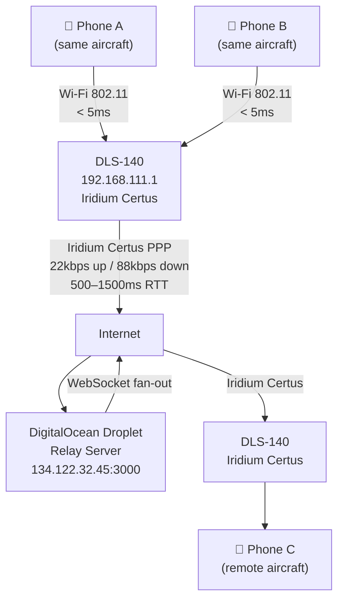
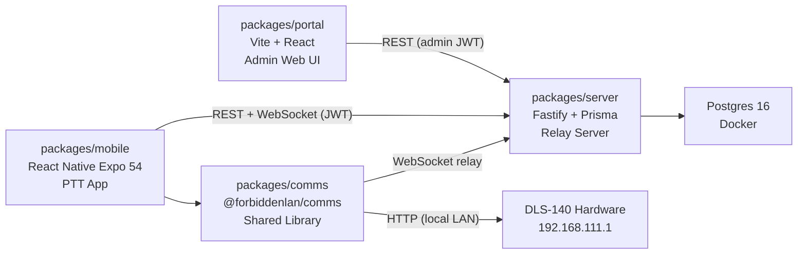

# System Overview

SkyTalk is built around one inescapable constraint: the DLS-140 satellite router on each aircraft cannot accept inbound connections. All communication must flow outbound through a relay server. This page explains how the system is structured around that reality.

---

## Physical Data Path

There is no direct path between DLS-140 units. All traffic transits the relay. This is a network-level constraint enforced by Iridium's carrier-grade NAT, not an architectural preference.

---

## Two Types of State

The architecture separates state into two buckets with different requirements:

**Persistent / security-critical state** (Postgres on the relay server)
- User accounts, roles, credentials
- Talkgroup definitions and membership
- Device registry (authorized hardware)
- Key material: `master_secret` + `rotation_counter` per talkgroup
- GPS history

Changes to this state are admin-controlled and have security implications. It survives server restarts.

**Ephemeral / operational state** (in-memory Maps on the relay server)
- Which WebSocket connections are currently live
- Which talkgroup each socket has joined
- In-progress PTT session routing (`sessionId → talkgroup`)

This state is rebuilt from scratch on each reconnect. Losing it on a server restart is acceptable — clients re-establish their rooms automatically.

This split means the hard problem of distributed security consensus is handled by a single authority (the relay + admin REST API), while real-time routing stays fast and simple.

---

## Component Map

**Dependency direction:** mobile and portal depend on server and comms. Comms depends on the server's WebSocket contract. Server depends on nothing else in the monorepo.

---

## What the Relay Server Does

The server has two distinct jobs:

**Control plane — REST API**
Source of truth for auth, talkgroup membership, device registry, and key material. The admin portal is the UI for this. An `admin`-role user can provision devices, manage talkgroups, trigger key rotations, and enable/disable devices.

**Data plane — WebSocket hub**
Maintains a room map: `talkgroup → Set<WebSocket>`. Messages from any client are fanned out to all other clients in the same talkgroup. The server does not decode audio — it relays encrypted blobs. It does maintain in-memory state for presence and session routing.

The server does **not**:
- Talk to DLS-140 hardware (that's the comms library's job)
- Decode or process audio (moves encrypted blobs only)
- Make floor control decisions (fans out `PTT_START`, clients arbitrate)
- Generate or distribute AES keys (stores `master_secret` + `rotation_counter`, clients derive keys via KDF)

---

## Package Responsibilities

| Package | Owner | What it delivers |
|---------|-------|-----------------|
| `packages/server` | Shri | Running relay server at `http://IP:3000` and `ws://IP:3000/ws`, all REST endpoints, JWT issuance |
| `packages/comms` | Saim | `@forbiddenlan/comms` library — WebSocket client, audio pipeline, AES-GCM encryption, floor control algorithm, DLS-140 client, GPS polling |
| `packages/mobile` | Maisam + Annie | PTT button, channel list, moving map, signal display, text messages |
| `packages/portal` | Maisam + Annie | Web admin UI — device management, talkgroup management, user list, key rotation |

---

## See Also

- [Satellite Constraints →](/docs/architecture/satellite-constraints) — the numbers that forced every decision
- [Floor Control →](/docs/architecture/floor-control) — why we can't use server-side grant/deny
- [Key Management →](/docs/architecture/key-management) — how encryption keys cross zero network boundaries as plaintext
