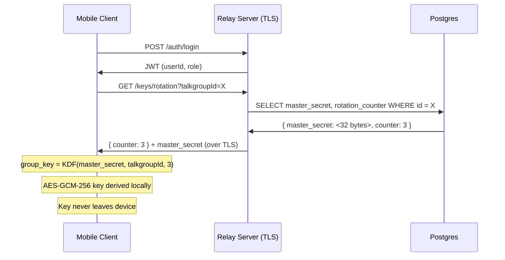

# Key Management

Audio is encrypted end-to-end using AES-GCM-256. The relay server moves encrypted blobs only — it cannot decrypt them. This page explains how encryption keys are derived and rotated without ever transmitting the actual key material over the network.

---

## The Core Principle

**Keys are derived, not distributed.**

The server stores two small values per talkgroup:
- `master_secret` — a random 32-byte value generated at talkgroup creation
- `rotation_counter` — an integer, incremented on each key rotation

After login, a client fetches these via REST over TLS:

```
GET /keys/rotation?talkgroupId=<id>
Authorization: Bearer <jwt>

→ { talkgroupId: "...", counter: 3 }
```

The client then runs:

```
group_key = KDF(master_secret, talkgroup_id, rotation_counter)
```

The output `group_key` (the actual AES-256 key) never leaves the device. The `master_secret` travels only once — over TLS from server to client. The server never sees the derived key.

---

## Key Derivation Flow



---

## Routine Key Rotation

When an admin triggers a rotation:

1. `POST /keys/rotate` — body: `{ talkgroupId }`
2. Server runs a Prisma `$transaction`:
   - Increments `rotation_counter` on the `Talkgroup` row
   - Inserts a `KeyRotation` audit log entry
3. Active clients fetch the new counter on their next sync
4. Each client recomputes the group key locally
5. Audio encoded with the old key becomes undecryptable to devices with the new key

No raw key material crosses any network boundary during rotation — only an integer increments.

---

## Device Revocation

When a device is revoked (stolen, compromised):

1. Admin sets `active = false` on the device record (`PATCH /devices/:id/status`)
2. Admin triggers a key rotation (`POST /keys/rotate`)
3. The revoked device's JWT expires (JWTs are short-lived)
4. Without a valid JWT, the device cannot re-authenticate
5. Without authentication, it cannot fetch the new `rotation_counter`
6. Without the counter, it cannot derive the new group key
7. Audio encrypted with the new key is undecryptable to the revoked device

---

## AES-GCM-256 Overhead

Each encrypted audio chunk carries:
- **12-byte random IV** — generated fresh per chunk
- **16-byte GCM authentication tag** — validates ciphertext integrity

Total per-chunk overhead: 28 bytes. At 6 kbps Opus with 60 ms frames (16.7 fps): **467 bytes/sec = 3,733 bps** — 17% of the uplink budget.

This overhead is non-negotiable for end-to-end confidentiality. The relay server cannot read audio; a compromised relay leaks only encrypted blobs.

Base64 encoding adds 33% on top of the raw ciphertext size (binary→ASCII for JSON transport). Phase 2 binary WebSocket frames eliminate this overhead.

---

## What the Server Stores vs What Clients Derive

| Data | Where it lives | Who can see it |
|------|---------------|----------------|
| `master_secret` (32 bytes) | Postgres | Server + authenticated clients (over TLS) |
| `rotation_counter` | Postgres | Server + authenticated clients |
| `group_key` (AES-256) | Client memory only | Client only — never stored, never transmitted |
| Encrypted audio blobs | In-flight on relay | Server sees ciphertext only |

---

## Current State vs Target Architecture

**v1 (implemented):** JWT-gated key fetch + KDF. `master_secret` is fetched over TLS after login. Group key derived locally. Rotation increments counter.

**Target (production):** A full distributed key tree — root key, site keys, device keys — where revoking a single site costs O(sites) key update messages, not O(devices). The design principles are identical to v1; the distribution mechanism scales for large deployments. The infrastructure (counter, rotation endpoint, audit log) is already in place.

<Callout type="warn">
The current mobile implementation uses a pass-through crypto polyfill (no real encryption) for mock mode development. Wire `encryption.init(derivedKey)` to the KDF output from `/keys/rotation` before any real satellite deployment.
</Callout>
