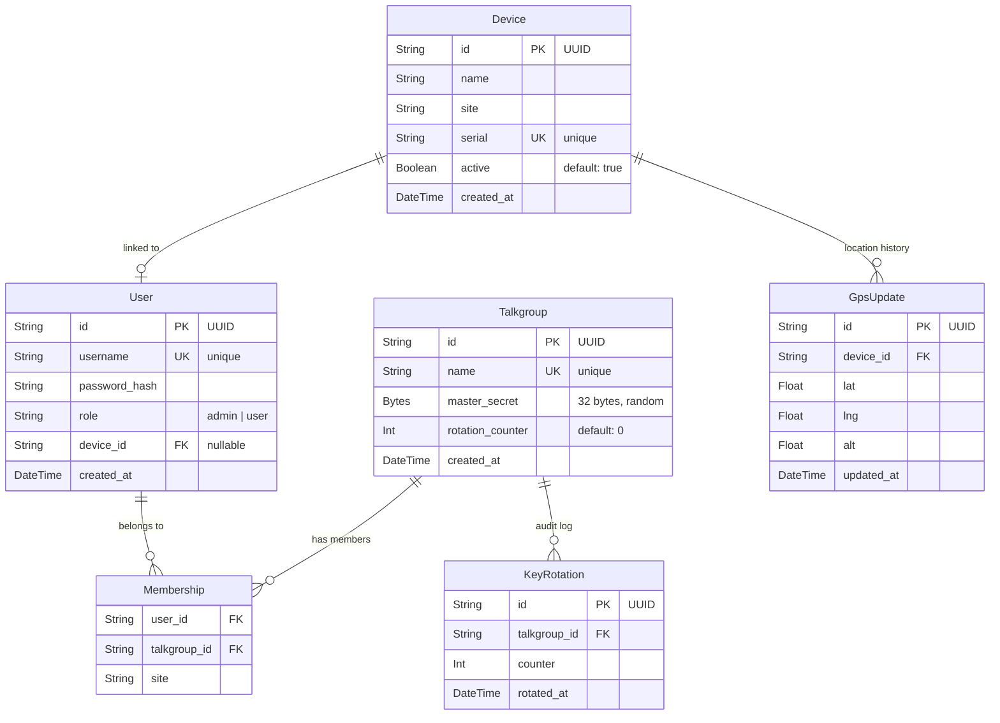

# Database Schema

Postgres 16 via Prisma ORM. Schema defined in `packages/server/prisma/schema.prisma`.

## Entity Relationship Diagram

## Table Descriptions

### Device

A physical phone or satellite terminal registered in the system.

| Column | Type | Notes |
|--------|------|-------|
| `id` | UUID | Primary key, auto-generated |
| `name` | String | Human-readable label |
| `site` | String | Physical location (e.g. "YVR", "tail-N123") |
| `serial` | String | Hardware serial — unique, used for registration |
| `active` | Boolean | `false` = device is disabled, cannot authenticate |
| `created_at` | DateTime | Registration timestamp |

### User

A person who logs in. One user per device (1:1, nullable).

| Column | Type | Notes |
|--------|------|-------|
| `id` | UUID | Primary key |
| `username` | String | Unique login name |
| `password_hash` | String | bcrypt cost 10 — never returned by API |
| `role` | String | `"admin"` or `"user"` |
| `device_id` | UUID | FK → Device, nullable (admins may have no device) |
| `created_at` | DateTime | Registration timestamp |

`role: "admin"` grants access to admin REST endpoints (device management, talkgroup creation, key rotation, user list).

### Talkgroup

A channel. All members of a talkgroup receive each other's audio.

| Column | Type | Notes |
|--------|------|-------|
| `id` | UUID | Primary key |
| `name` | String | Unique, human-readable |
| `master_secret` | Bytes | 32 random bytes, generated at creation — never returned by `/keys/rotation` directly; used as KDF input |
| `rotation_counter` | Int | Incremented on each key rotation |
| `created_at` | DateTime | |

`master_secret` is generated with `randomBytes(32)` at talkgroup creation and never regenerated. Key rotation only increments the counter. The KDF output changes; the secret stays.

### Membership

Join table. Which users are in which talkgroups. Composite primary key.

| Column | Type | Notes |
|--------|------|-------|
| `user_id` | UUID | FK → User |
| `talkgroup_id` | UUID | FK → Talkgroup |
| `site` | String | User's site at time of join |

The `site` field is populated from the user's linked device at join time (defaults to `"unknown"` if no device is linked).

### KeyRotation

Audit log. One row per rotation event.

| Column | Type | Notes |
|--------|------|-------|
| `id` | UUID | Primary key |
| `talkgroup_id` | UUID | FK → Talkgroup |
| `counter` | Int | The counter value after this rotation |
| `rotated_at` | DateTime | When the rotation occurred |

### GpsUpdate

Location history. One row per GPS fix received. Not upserted — every fix is a new row.

| Column | Type | Notes |
|--------|------|-------|
| `id` | UUID | Primary key |
| `device_id` | UUID | FK → Device |
| `lat` | Float | Latitude |
| `lng` | Float | Longitude |
| `alt` | Float | Altitude (meters) |
| `updated_at` | DateTime | UTC timestamp of the fix |

`GET /devices/:id/gps` returns the most recent row (`findFirst` ordered by `updated_at desc`). This is not a `@unique` column — devices produce a stream of GPS fixes, not a single point.

## Seed Data

Running `docker compose exec server npx tsx prisma/seed.ts` creates:

| Resource | Value |
|----------|-------|
| Admin user | username: `admin`, password: `admin`, role: `admin` |
| Pilot user | username: `pilot1`, password: `test`, role: `user` |
| Talkgroup | name: `Ground Ops`, random `master_secret`, `rotation_counter: 0` |
| Memberships | Both users in Ground Ops |

The seed uses `upsert` — safe to run multiple times. It also corrects the admin role if the admin account was previously registered via the REST API (which always creates `role: "user"`).
