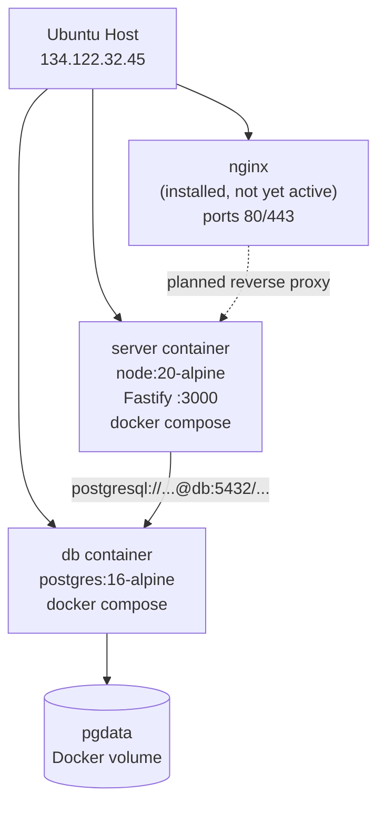

# Deployment Architecture

## Droplet Specs

| Property | Value |
|----------|-------|
| Provider | DigitalOcean |
| Region | Toronto (TOR1) |
| OS | Ubuntu LTS |
| CPU | 2 vCPU |
| RAM | 4 GB |
| Disk | 120 GB SSD |
| Public IP | 134.122.32.45 |
| Domain | forbiddenlan.foo (DNS not yet pointed) |

## Running Services



Currently, teammates connect directly to `http://134.122.32.45:3000`. nginx is installed and the site config is written (`packages/server/nginx/forbiddenlan.foo.conf`) but not yet active — waiting for DNS to propagate to the domain.

## Deployment Workflow

There is no CI/CD. Deployment is manual:

```bash
# 1. Push changes locally
git add . && git commit -m "..." && git push

# 2. On the droplet
cd ~/TheForbiddenLAN
git pull

# 3. Rebuild and restart
cd packages/server
docker compose up --build -d
```

`docker compose up --build` rebuilds the server image (TypeScript compile + `prisma generate`), then restarts the container. Postgres data is preserved in the `pgdata` volume.

## What Happens on Container Start

`entrypoint.sh` runs before the Fastify server starts:

```bash
npx prisma db push    # Sync schema to Postgres
node dist/index.js    # Start the server
```

`prisma db push` is idempotent — it creates tables if they don't exist or alters them to match the current schema. This means schema changes in `prisma/schema.prisma` are applied automatically on deploy without a separate migration step.

## Port Map

| Service | Internal | External | Notes |
|---------|----------|----------|-------|
| Fastify server | 3000 | 3000 | Direct access, all traffic |
| Postgres | 5432 | — | Not published to host |

## nginx + SSL (Pending)

The nginx config is ready at `packages/server/nginx/forbiddenlan.foo.conf`. When the domain DNS is pointed at the droplet:

```bash
# On the droplet
cp ~/TheForbiddenLAN/packages/server/nginx/forbiddenlan.foo.conf \
   /etc/nginx/sites-available/forbiddenlan.foo
ln -s /etc/nginx/sites-available/forbiddenlan.foo \
      /etc/nginx/sites-enabled/
nginx -t && systemctl reload nginx

apt install -y certbot python3-certbot-nginx
certbot --nginx -d forbiddenlan.foo
```

After this, teammates use `https://forbiddenlan.foo` and `wss://forbiddenlan.foo/ws`.

## Monitoring

No automated monitoring. To check server health:

```bash
# From anywhere
curl http://134.122.32.45:3000/ping

# On the droplet
docker compose logs server --tail=50 -f
docker compose ps
```
