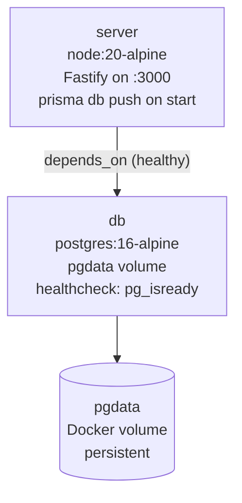

# Infrastructure

## Decision

**A single DigitalOcean droplet** (Ubuntu, 2 vCPU, 4 GB RAM) running Docker Compose with two services: Postgres 16 and the Node.js relay server. No Kubernetes, no managed database, no CDN.

## Constraints That Drove This

- One week to deploy and have teammates' devices connecting over satellite.
- The relay server is stateful — WebSocket rooms live in memory. Horizontal scaling requires coordination (Redis pub/sub or sticky sessions). We don't need to scale to more than one instance for a hackathon.
- The Postgres database is co-located with the server. Sub-millisecond query latency on `findUnique` calls (JWT verification path) matters for WebSocket connection throughput.
- Budget: DigitalOcean $24/month droplet is the entire infrastructure cost.
- The deployment workflow is: push to git → ssh → `git pull` → `docker compose up --build -d`. This needs to work reliably without CI/CD.

## Alternatives Considered

| Option | Why We Didn't Choose It |
|--------|------------------------|
| **Kubernetes (GKE, EKS, AKS)** | Multi-hour setup, requires understanding of Deployments, Services, Ingress, ConfigMaps, Secrets, PersistentVolumeClaims. Overkill for a single stateful service. |
| **AWS Elastic Beanstalk / App Runner** | Higher cost, more config surface, harder to debug. We need direct ssh access and control over the exact Node.js version. |
| **Serverless (Lambda, Cloud Run)** | WebSocket requires a persistent server process. Serverless functions timeout after 15–30 seconds — incompatible with long-lived PTT sessions. Cold start latency at 500 ms satellite RTT is unacceptable. |
| **Managed Postgres (RDS, Neon, Supabase)** | Adds inter-service network latency (even within a region: 1–5 ms). More importantly, adds monthly cost and a separate connection string to manage. Self-hosted in Docker Compose on the same machine has ~0.1 ms query latency and zero additional cost. |
| **Multi-region deployment** | The relay is a single switchboard. All aircraft connect to one server. Multiple regions would require routing logic (which region is closest to the satellite ground station?) that adds complexity without benefit at hackathon scale. |
| **nginx reverse proxy + SSL (done, but deferred)** | nginx config and Let's Encrypt cert are written and ready in `packages/server/nginx/`. Deferred because the team uses the IP directly over HTTP during development, and SSL requires DNS propagation (up to an hour). Will be activated when the domain is pointed at the droplet. |

## Why DigitalOcean + Docker Compose

**DigitalOcean droplets** are predictable, fast to provision, and have a straightforward billing model. The Carleton team has prior experience with them. SSH access is immediate. No IAM policies, no VPC configuration, no security group rules — just a server with a public IP.

**Docker Compose** makes the two-service dependency (Postgres + server) declarative and reproducible. The `depends_on` with `service_healthy` ensures Postgres is ready before the server starts. `prisma db push` runs in the server container's `entrypoint.sh` on every start — schema is always in sync, no manual migration step. The entire server environment is reproducible from `docker compose up --build`.

**Why not just run Node.js directly?** Running in Docker means:
- Node.js version is pinned (node:20-alpine) and reproducible across environments
- Postgres runs in isolation — no system-level Postgres install, no version conflicts
- The entire stack can be torn down and rebuilt cleanly in < 2 minutes
- Future teammates can reproduce the deployment by running one command

## Docker Compose Service Graph

Port `3000` is published to the host (`0.0.0.0:3000`). Teammates connect at `http://134.122.32.45:3000`.

## Tradeoffs We Accepted

**Single point of failure.** If the droplet goes down, all comms cease. There is no failover. For a hackathon demo, acceptable. Production would require at minimum a health-monitored standby or managed hosting with SLAs.

**No TLS in development.** Traffic between clients and the relay server is plain HTTP/WebSocket during development. The nginx config and SSL certificate setup are ready but deferred. For a demo over a local network or managed demo environment, acceptable.

**Manual deployment.** `git pull && docker compose up --build -d` is the deployment process. No CI/CD, no rollback. A broken push means manual ssh and `docker compose logs` diagnosis. For one week, this is fine.

**No automated backups.** The Postgres volume (`pgdata`) has no automated backup. The database contains development/hackathon data only — losing it is an inconvenience, not a crisis.
